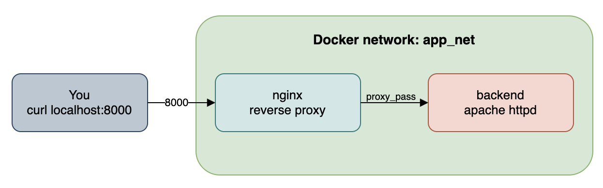

# Step 3: A real scenario

Lets now pretend that you are a second engineer working on this project, you have done some testing with some test containers and everything is working as it should. You are now cleaning up after your tests.

Run the following command to remove one of your test containers:

```bash
docker rm -f backend
```

<details>
<summary>What now? [Click here]</summary>

Oops, that wasn't a test container. You've just deleted `backend`, the container your nginx reverse proxy depends on.

*Recall* the architecture:




Check what happened:

```bash
curl localhost:8000
```
Notice anything? Nginx is still running... but it can no longer reach the backend it depends on.

> It will try for a while to access the backend, it will eventually fail, if you wanna stop it, just press `CTRL+C` to stop the process.

Please continue to the next step to see how we can fix this issue.


</details>

